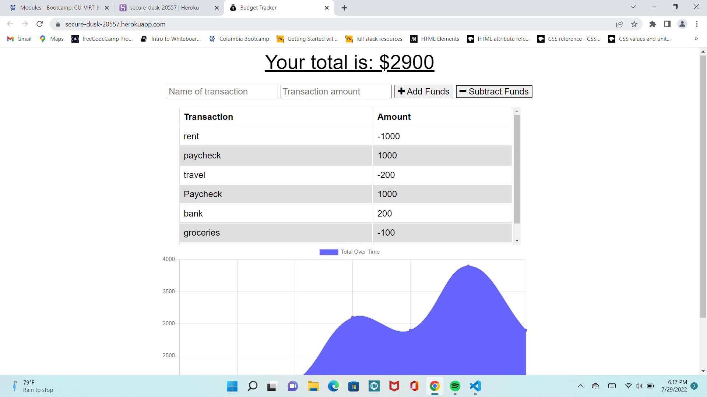
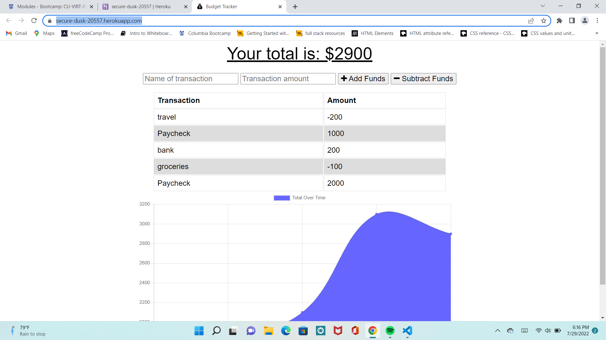
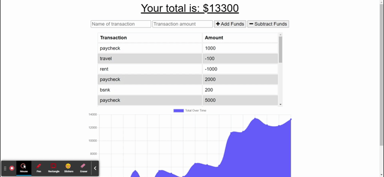

# budget-tracker-pwa
## Description
This application helps a user track their expenses both in online and offline modes.

## Table of Contents
* [Usage](#Usage)
* [Heroku-Link](#Heroku-Link)
* [Credits/Citations](#Credits/Citations)
* [Features](#Features)
* [Applications-Used](#Applications-Used)
* [Screenshots](#Screenshots)

## Usage
To use the application on the local terminal, the user must download npm packages and run npm start which will invoke the application from the terminal. However, user can use the heroku link to view the application online and offline. This application was created using node packages of Express. IndexedDB was used to add offline functionality. 

## Heroku-Link
**[Click here for heroku link](https://secure-dusk-20557.herokuapp.com/)**

## Credits/Citations
* Class activities for coding service workers file - class activity 05-Notetaker PWA
* TA Charlie for explaining and helping code service workers, how to write a manifest, understand offline functionality for idb.js and for helping me deploy my application to heroku.
* Module 18 lesson on NoSql and for coding idb.js file, lesson 4 - https://courses.bootcampspot.com/courses/1196/pages/18-dot-4-3-introducing-indexeddb?module_item_id=463159
* Module 19 lesson 4 on PWA and service worker - https://courses.bootcampspot.com/courses/1196/pages/19-dot-4-3-introduction-to-service-workers?module_item_id=463581
* Module 18 lesson 5 on linking MongoDB Atlas with Heroku - https://courses.bootcampspot.com/courses/1196/pages/18-dot-5-1-introduction?module_item_id=463209
* Starter code provided in assignment to get started

## Features
The user can enter their expenses and incomes and view a graph which shows their expenditure and income over a period of time. However, if the user is offline, the app will still function and remember their data and display their income and expenditure offline as well.

## Applications-Used
* Node.js
* Exppress
* Heroku
* MongoDB Atlas
* IndexedDB
* Markdown
* JavaScript

## Screenshots
See below screenshots of generated Readme

